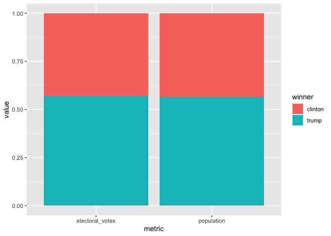
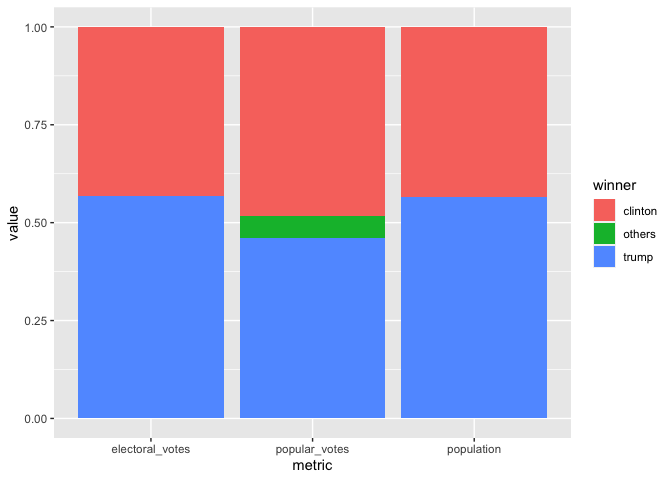

Assignment 7: Relational data plus revisiting data wrangling and visualization
================

## Instructions: Please read through this before you begin

-   This homework is due by **10pm on Wednesday 03/31/20**. Please upload it using your personal GitHub repository for this class.

-   Please name your R markdown file `assignment_7.Rmd` and the knitted markdown file `assignment_7.md`.

-   For this assignment, please **reproduce this markdown file** using R markdown. This includes the followings:

    -   **Reproduce this markdown template**, except for this list of instructions which you **don't** have to include. Pay attention to all the formating in this file, including bullet points, bolded characters, inserted code chunks, headings, text colors, blank lines, etc.

    -   Have all your code embedded within the R markdown file, and show **BOTH your code and plots** in the knitted markdown file.

    -   Use R Markdown functionalities to **hide messages and warnings when needed**. (Suggestion: messages and warnings can often be informative and important, so please examine them carefully and only turn them off when you finish the exercise).

-   To start, first load all the required packages with the following code. Install them if they are not installed yet.

``` r
library(tidyverse)
library(knitr)
library(dslabs)
```

<br>

## Excercise: 2016 election result and polling

For this exercise, we will explore the result of the 2016 US presidential election as well as the polling data. We will use the following three datasets in the `dslabs` package, and use `join` function to connect them together. As a reminder, you can use `?` to learn more about these datasets.

-   `results_us_election_2016`: Election results (popular vote) and electoral college votes from the 2016 presidential election.

-   `polls_us_election_2016`: Poll results from the 2016 presidential elections.

-   `murders`: Gun murder data from FBI reports. It also contains the population of each state.

We will also use [this dataset](https://raw.githubusercontent.com/kshaffer/election2016/master/2016ElectionResultsByState.csv) to get the exact numbers of votes for question 3.

<br>

### Question 1. What is the relationship between the population size and the number of electoral votes each state has?

**1a.** Use a `join` function to combine the `murders` dataset, which contains information on population size, and the `results_us_election_2016` dataset, which contains information on the number of electoral votes. Name this new dataset `q_1a`, and show its first 6 rows.

| state      | abb | region |  population|  total|  electoral\_votes|  clinton|  trump|  others|
|:-----------|:----|:-------|-----------:|------:|-----------------:|--------:|------:|-------:|
| Alabama    | AL  | South  |     4779736|    135|                 9|     34.4|   62.1|     3.6|
| Alaska     | AK  | West   |      710231|     19|                 3|     36.6|   51.3|    12.2|
| Arizona    | AZ  | West   |     6392017|    232|                11|     45.1|   48.7|     6.2|
| Arkansas   | AR  | South  |     2915918|     93|                 6|     33.7|   60.6|     5.8|
| California | CA  | West   |    37253956|   1257|                55|     61.7|   31.6|     6.7|
| Colorado   | CO  | West   |     5029196|     65|                 9|     48.2|   43.3|     8.6|

<br> <br>

**1b.** Add a new variable in the `q_1a` dataset to indicate which candidate won in each state, and remove the columns `abb`, `region`, and `total`. Name this new dataset `q_1b`, and show its first 6 rows.

| state      |  population|  electoral\_votes|  clinton|  trump|  others| winner  |
|:-----------|-----------:|-----------------:|--------:|------:|-------:|:--------|
| Alabama    |     4779736|                 9|     34.4|   62.1|     3.6| trump   |
| Alaska     |      710231|                 3|     36.6|   51.3|    12.2| trump   |
| Arizona    |     6392017|                11|     45.1|   48.7|     6.2| trump   |
| Arkansas   |     2915918|                 6|     33.7|   60.6|     5.8| trump   |
| California |    37253956|                55|     61.7|   31.6|     6.7| clinton |
| Colorado   |     5029196|                 9|     48.2|   43.3|     8.6| clinton |

<br> <br>

**1c.** Using the `q_1b` dataset, plot the relationship between population size and number of electoral votes. Use color to indicate who won the state. Fit a straight line to the data, set its color to black, size to 0.1, and turn off its confidence interval.


<br> <br>

### Question 2. Would the election result be any different if the number of electoral votes is exactly proportional to a state's population size?

**2a.** First, convert the `q_1b` dataset to longer format such that the `population` and `electoral_votes` columns are turned into rows as shown below. Name this new dataset `q_2a`, and show its first 6 rows.

| state   |  clinton|  trump|  others| winner | metric           |    value|
|:--------|--------:|------:|-------:|:-------|:-----------------|--------:|
| Alabama |     34.4|   62.1|     3.6| trump  | population       |  4779736|
| Alabama |     34.4|   62.1|     3.6| trump  | electoral\_votes |        9|
| Alaska  |     36.6|   51.3|    12.2| trump  | population       |   710231|
| Alaska  |     36.6|   51.3|    12.2| trump  | electoral\_votes |        3|
| Arizona |     45.1|   48.7|     6.2| trump  | population       |  6392017|
| Arizona |     45.1|   48.7|     6.2| trump  | electoral\_votes |       11|

<br> <br>

**2b.** Then, sum up the number of electoral votes and population size across all states for each candidate. Name this new dataset `q_2b`, and print it as shown below.

| metric           | winner  |      value|
|:-----------------|:--------|----------:|
| electoral\_votes | clinton |        233|
| electoral\_votes | trump   |        305|
| population       | clinton |  134982448|
| population       | trump   |  174881780|

<br> <br>

**2c.** Use the `q_2b` dataset to contruct a bar plot to show the final electoral vote share under the scenarios of **1)** each state has the number of electoral votes that it currently has, and **2)** each state has the number of electoral votes that is exactly proportional to its population size. Here, assume that for each state, the winner will take all its electoral votes.

<br>

*Hint: `geom_col(position = "fill")` might be helpful.*



<br> <br>

### Question 3. What if the election was determined by popular votes?

**3a.** First, from [this dataset on GitHub](https://raw.githubusercontent.com/kshaffer/election2016/master/2016ElectionResultsByState.csv), calculate the number of popular votes each candidate received as shown below. Name this new dataset `q_3a`, and print it. <br>

*Hint: `pivot_longer()` may be useful in here.*

| metric         | winner  |     value|
|:---------------|:--------|---------:|
| popular\_votes | clinton |  65125640|
| popular\_votes | trump   |  62616675|
| popular\_votes | others  |   7054974|

<br> <br>

**3b.** Combine the `q_2b` dataset with the `q_3a` dataset. Call this new dataset `q_3b`, and print it as shown below.

| metric           | winner  |      value|
|:-----------------|:--------|----------:|
| electoral\_votes | clinton |        233|
| electoral\_votes | trump   |        305|
| population       | clinton |  134982448|
| population       | trump   |  174881780|
| popular\_votes   | clinton |   65125640|
| popular\_votes   | trump   |   62616675|
| popular\_votes   | others  |    7054974|

<br> <br>

**3c.** Lastly, use the `q_3b` dataset to contruct a bar plot to show the final vote share under the scenarios of **1)** each state has the number of electoral votes that it currently has, **2)** each state has the number of electoral votes that is exactly proportional to its population size, and **3)** the election result is determined by the popular vote.



<br> <br>

### Question 4. The election result in 2016 came as a huge surprise to many people, especially given that most polls predicted Clinton would win before the election. Where did the polls get wrong?

**4a.** The polling data is stored in the data frame `polls_us_election_2016`. For the sake of simplicity, we will only look at the data from a single poll for each state. Subset the polling data to include only the results from the pollster `Ipsos`. Exclude national polls, and for each state, select the polling result with the `enddate` closest to the election day (i.e. those with the lastest end date). Keep only the columns `state`, `adjpoll_clinton`, and `adjpoll_trump`. Save this new dataset as `q_4a`, and show its first 6 rows.

<br>

*Note: You should have 47 rows in `q_4a` because only 47 states were polled at least once by Ipsos. You don't need to worry about the 3 missing states and DC.*

*Hint: `group_by()` and `slice_max()` can be useful for this question. Check out the help file for `slice_max()` for more info.*

| state       |  adjpoll\_clinton|  adjpoll\_trump|
|:------------|-----------------:|---------------:|
| Alabama     |          37.54023|        53.69718|
| Arizona     |          41.35774|        46.17779|
| Arkansas    |          37.15339|        53.28384|
| California  |          58.33806|        31.00473|
| Colorado    |          46.00764|        40.73571|
| Connecticut |          48.81810|        38.87069|

<br> <br>

**4b.** Combine the `q_4a` dataset with the `q_1b` dataset with a `join` function. The resulting dataset should only have 47 rows. Create the following new variables in this joined dataset.

-   `polling_margin`: difference between `adjpoll_clinton` and `adjpoll_trump`
-   `actual_margin`: difference between `clinton` and `trump`
-   `polling_error`: difference between `polling_margin` and `actual_margin`
-   `predicted_winner`: predicted winner based on `adjpoll_clinton` and `adjpoll_trump`
-   `result = ifelse(winner == predicted_winner, "correct prediction", str_c("unexpected ", winner, " win"))`

Keep only the columns `state`, `polling_error`, `result`, `electoral_votes`. Name the new dataset `q_4b` and show its first 6 rows.

| state       |  polling\_error| result             |  electoral\_votes|
|:------------|---------------:|:-------------------|-----------------:|
| Alabama     |        11.54305| correct prediction |                 9|
| Arizona     |        -1.22005| correct prediction |                11|
| Arkansas    |        10.76955| correct prediction |                 6|
| California  |        -2.76667| correct prediction |                55|
| Colorado    |         0.37193| correct prediction |                 9|
| Connecticut |        -3.75259| correct prediction |                 7|

<br> <br>

**4c.** Generate the following plot with the `q_4b` dataset. Use chunk options to adjust the dimensions of the plot to make it longer than the default dimension. Based on this plot, where did the polls get wrong in the 2016 election?


<br> <br>
