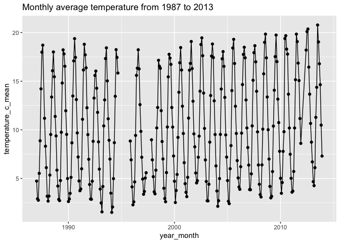
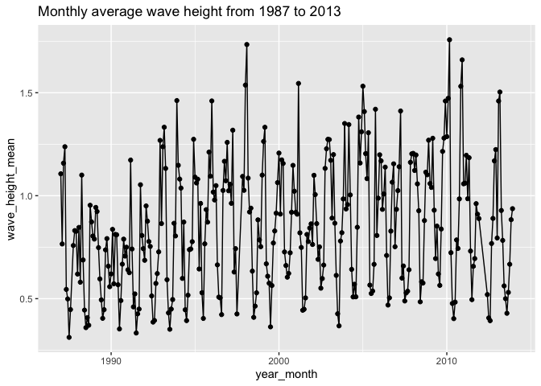

Assignment 8: Iteration and conditional execution
================

<br>

## Instructions: Please read through this before you begin

- This homework is due by **10pm on Thursday 10/24/2024**. Please upload
  it using your personal GitHub repository for this class.

- Please name your R markdown file `assignment_8.Rmd` and the knitted
  markdown file `assignment_8.md`.

- For this assignment, please **reproduce this markdown file** using R
  markdown. This includes the followings:

  - **Reproduce this markdown template**, except for this list of
    instructions which you **don’t** have to include. Pay attention to
    all the formatting in this file, including bullet points, bolded
    characters, inserted code chunks, headings, text colors, blank
    lines, etc.

  - Have all your code embedded within the R markdown file, and show
    **BOTH your code and plots** in the knitted markdown file.

  - Use R Markdown functionalities to **hide messages and warnings when
    needed**. (Suggestion: messages and warnings can often be
    informative and important, so please examine them carefully and only
    turn them off when you finish the exercise).

- Please note that Questions 2.5 is **optional**.

- To start, first load all the required packages with the following
  code. Install them if they are not installed yet.

``` r
library(tidyverse)
```

<br>

**Acknowledgements:** Exercise 1 has been adapted (with permission) from
the [Data Carpentry for Biologists semester
course](https://datacarpentry.org/semester-biology/exercises/Functions-use-and-modify-Python/)
and exercises 2 was adapted (with permission) from Iain Carmichael’s
course [STOR 390: Introduction to Data
Science](https://idc9.github.io/stor390/#course_material).

<br>

**Note:** In this assignment, for loops are written in a way such that
the output is grown in each iteration using functions such as `c()` and
`bind_rows()`. Although this is perhaps a more intuitive method, be
aware that it is less efficient computationally compared to predefining
the length of the output. For more information on this, we highly
recommend you to read the [for loops
section](https://r4ds.had.co.nz/iteration.html#for-loops) in the R for
Data Science book.

<br>

## Exercise 1: Body mass estimation using vectorization vs. for loop

There are two major types of approaches to perform multiple operations
in R:
[vectorization](https://swcarpentry.github.io/r-novice-gapminder/09-vectorization/)
and for loops. As a simple example, to calculate the sum of two vectors,
`x` and `y`, the syntax for vectorization is simply `z <- x + y`. With
this, the computer will be able to perform the same operation to each
element of x and y vector **simultaneously**.

The for loop approach to achieve the same task (create a new vector z
that is the sum of vectors x and y), on the other hand, takes the
following form:

``` r
z <- NULL
for (i in 1:length(x)){
  z <- c(z, x[i] + y[i])
}
```

In this case, the computer loops through each element of x and y and
performs the operation **sequentially**, resulting in a significantly
longer runtime. Let’s now try to quantify this difference in runtime in
this exercise.

<br>

#### 1.1 A single operation

The length of an organism is typically strongly correlated with its body
mass. This is useful because it allows us to estimate the mass of an
organism even if we only know its length. This relationship generally
takes the form: `mass = a * length ^ b`, where the parameters `a` and
`b` vary among groups. This allometric approach is regularly used to
estimate the mass of dinosaurs since we cannot weigh something that is
only preserved as bones.

*Spinosaurus* is a predator that is bigger, and therefore, by
definition, cooler, than that stupid *Tyrannosaurus* that everyone likes
so much. It has an estimated `a` of `0.73` and `b` of `3.63`. What is
the estimated mass of a *Spinosaurus* that is `16` m long based on its
reassembled skeleton?

    ## [1] 17150.56

<br>

#### 1.2 Multiple operations

The following vectors contain the `length`s of 200 dinosaurs and their
respective `a` and `b` values. Estimate their `mass` first using a
vectorization approach and then using a for loop approach.

``` r
dinosaur_lengths <- c(25.31, 16.7, 25.22, 24.08, 13.85, 24.57, 18.61, 17.79, 26.31, 15.02, 13.42, 16.4, 22.75, 23.68, 21.93, 17.33, 14.74, 21.52, 30.51, 10.98, 20.2, 16.1, 19.1, 13.65, 14.23, 26.76, 25.51, 26.03, 24.89, 18.49, 18.93, 25.46, 23.54, 11.81, 10.66, 30.36, 14.2, 21.34, 21.3, 23.46, 20.77, 17.27, 31, 17.66, 26.02, 16.02, 15.1, 26.05, 22.6, 23.22, 10.35, 21.14, 17.91, 15.35, 13.91, 26.17, 24.89, 16.86, 22.11, 27.07, 14.31, 12.02, 9.82, 19.85, 28.61, 22.57, 13.43, 10.41, 23.26, 22.65, 18.91, 26.58, 12.71, 9.34, 23.97, 22.89, 24.71, 10.73, 20.88, 18.67, 13.26, 16.38, 21.24, 13.39, 21.2, 21.36, 16.49, 26.13, 20.04, 18.9, 16.71, 24.74, 19.98, 18.05, 12.95, 22.64, 16.03, 11.21, 22.48, 20.48, 25.76, 12.01, 17.86, 17.12, 25.34, 22.18, 20.95, 21.17, 14.52, 20.82, 17.87, 27.45, 29.99, 31.3, 24.68, 22.55, 18.13, 18.97, 23.3, 18.66, 19.9, 25.52, 19.89, 24.7, 18.25, 24.53, 23.47, 16.26, 15.08, 19.67, 24.12, 26.03, 29.29, 16.65, 21.55, 22.44, 17.65, 24.67, 23.38, 18.18, 20.5, 25.62, 18.99, 13.3, 16.55, 29.76, 13.74, 25.04, 19.42, 26.29, 10.71, 22.19, 20.03, 23.14, 14.28, 18.93, 27.57, 16.3, 16.05, 23.26, 25.09, 16.97, 22.75, 16.62, 28.7, 20.82, 26.79, 20.75, 28.74, 19.59, 22.94, 24.51, 18.09, 16.91, 16.53, 20.89, 29.85, 12.89, 21.01, 19.41, 23.43, 21.13, 24.58, 23.22, 11.93, 22.36, 22.04, 27.25, 24.24, 11.39, 22.62, 24.38, 21.95, 17, 30.64, 29.53, 25.13, 20.21, 17.51, 26.25)

a_values <- c(0.61, 0.74, 0.82, 0.78, 0.85, 0.72, 0.84, 0.65, 0.58, 0.82, 0.78, 0.8, 0.69, 0.65, 0.75, 0.72, 0.7, 0.7, 0.65, 0.77, 0.67, 0.86, 0.63, 0.6, 0.67, 0.57, 0.63, 0.72, 0.78, 0.91, 0.67, 0.81, 0.73, 0.8, 0.54, 0.77, 0.86, 0.81, 0.9, 0.68, 0.58, 0.8, 0.72, 0.67, 0.84, 0.63, 0.82, 0.61, 0.74, 0.83, 0.88, 0.66, 0.8, 0.72, 0.75, 0.58, 0.78, 0.76, 0.76, 0.77, 0.91, 0.57, 0.73, 0.87, 0.78, 0.72, 0.73, 0.89, 0.52, 0.87, 0.7, 0.67, 0.7, 0.81, 0.75, 0.7, 0.79, 0.83, 0.57, 0.88, 0.79, 0.77, 0.83, 0.69, 0.69, 0.91, 0.86, 0.66, 0.67, 0.88, 0.78, 0.82, 0.72, 0.86, 0.8, 0.69, 0.7, 0.68, 0.71, 0.83, 0.8, 0.64, 0.68, 0.51, 0.78, 0.8, 0.71, 0.73, 0.88, 0.83, 0.76, 0.95, 0.84, 0.75, 0.85, 0.79, 0.64, 0.94, 0.83, 0.64, 0.83, 0.8, 0.62, 0.79, 0.72, 0.8, 0.63, 0.79, 0.88, 0.64, 0.77, 0.85, 0.93, 0.85, 0.9, 0.83, 0.88, 0.95, 0.64, 0.78, 0.82, 0.77, 0.53, 0.96, 0.78, 0.66, 0.76, 0.69, 0.74, 0.64, 0.79, 1.05, 0.59, 0.82, 0.73, 0.64, 0.8, 0.86, 0.95, 0.95, 0.64, 0.87, 0.75, 0.59, 0.73, 0.7, 0.7, 0.8, 0.79, 0.75, 0.76, 0.64, 0.77, 0.64, 0.78, 0.75, 0.85, 0.75, 0.87, 0.72, 0.7, 0.62, 0.64, 0.79, 0.63, 0.71, 0.79, 0.66, 0.86, 0.93, 0.39, 0.62, 0.73, 0.7, 0.69, 0.7, 0.72, 0.81, 0.77, 0.57)

b_values <- c(3.63, 3.57, 3.51, 3.5, 3.65, 3.64, 3.6, 3.59, 3.58, 3.61, 3.55, 3.61, 3.57, 3.61, 3.62, 3.62, 3.57, 3.6, 3.56, 3.59, 3.63, 3.61, 3.59, 3.66, 3.54, 3.59, 3.56, 3.65, 3.58, 3.6, 3.66, 3.58, 3.64, 3.62, 3.59, 3.65, 3.56, 3.64, 3.6, 3.52, 3.56, 3.63, 3.59, 3.63, 3.68, 3.65, 3.47, 3.49, 3.64, 3.65, 3.64, 3.6, 3.61, 3.66, 3.62, 3.6, 3.67, 3.62, 3.65, 3.57, 3.53, 3.55, 3.66, 3.51, 3.51, 3.64, 3.62, 3.65, 3.59, 3.68, 3.51, 3.63, 3.59, 3.56, 3.57, 3.66, 3.56, 3.63, 3.61, 3.62, 3.7, 3.63, 3.57, 3.58, 3.6, 3.57, 3.58, 3.58, 3.55, 3.49, 3.71, 3.56, 3.6, 3.59, 3.56, 3.65, 3.65, 3.65, 3.58, 3.57, 3.57, 3.57, 3.52, 3.53, 3.75, 3.68, 3.56, 3.71, 3.57, 3.58, 3.58, 3.57, 3.64, 3.56, 3.63, 3.53, 3.6, 3.7, 3.64, 3.62, 3.59, 3.59, 3.57, 3.58, 3.56, 3.61, 3.6, 3.59, 3.63, 3.63, 3.61, 3.62, 3.59, 3.49, 3.53, 3.58, 3.66, 3.59, 3.69, 3.65, 3.59, 3.67, 3.59, 3.64, 3.61, 3.53, 3.54, 3.49, 3.68, 3.63, 3.64, 3.62, 3.7, 3.69, 3.59, 3.58, 3.61, 3.56, 3.72, 3.58, 3.64, 3.57, 3.72, 3.6, 3.49, 3.63, 3.55, 3.58, 3.62, 3.63, 3.65, 3.57, 3.7, 3.59, 3.64, 3.59, 3.69, 3.5, 3.6, 3.61, 3.56, 3.64, 3.58, 3.62, 3.63, 3.56, 3.66, 3.63, 3.49, 3.54, 3.73, 3.61, 3.47, 3.53, 3.68, 3.63, 3.63, 3.59, 3.52, 3.62)
```

<br>

- with vectorization:

<!-- -->

    ##   [1]  75732.156  17152.583  68224.300  53443.180  12465.526  82871.894
    ##   [7]  31287.166  20000.691  70381.842  14507.491   7863.503  19439.106
    ##  [13]  48225.051  59488.263  53656.348  21967.634  10390.443  43987.593
    ##  [19] 125177.887   4190.377  36685.993  19549.689  25017.870   8565.185
    ##  [25]   8098.790  75953.884  64154.893 105636.307  77600.359  33114.200
    ##  [31]  31655.272  87389.265  71894.947   6090.243   2642.665 198103.512
    ##  [37]  10880.402  55815.226  54501.579  45296.380  28412.008  24800.542
    ##  [43] 162675.061  22524.286 135709.460  15716.604  10112.624  53271.976
    ##  [49]  62832.804  80255.569   4353.771  38897.517  26715.607  15793.892
    ##  [55]  10325.366  73709.149 103634.886  20991.235  61455.747 100109.156
    ##  [61]  10925.701   3886.295   3122.129  31236.232 101035.102  60839.743
    ##  [67]   8850.301   4603.468  41892.107  84366.543  21197.532  99359.493
    ##  [73]   6441.404   2306.322  63164.948  66282.921  71821.433   4572.514
    ##  [79]  33120.886  35158.076  11247.037  19699.272  45396.221   7459.738
    ##  [85]  41082.625  50782.941  19595.141  78145.329  28042.175  25080.395
    ##  [91]  26874.304  74871.540  34631.894  27877.359   7290.719  60834.232
    ##  [97]  17502.714   4608.604  49055.660  39858.965  87129.797   4572.445
    ## [103]  17343.296  11530.243 143340.658  71817.199  35865.219  60498.867
    ## [109]  12379.511  43575.170  23089.764 129813.479 199743.944 158197.314
    ## [115]  96301.231  47231.789  21697.618  50347.392  78750.559  25519.967
    ## [121]  38190.965  89906.604  26823.649  76468.432  22255.036  83156.870
    ## [127]  54098.805  17601.506  16675.526  31819.240  75313.493 113092.919
    ## [133] 171397.899  15565.197  45847.049  56982.291  32178.686  94538.967
    ## [139]  71980.723  30875.376  41976.886 113756.472  20614.865  11832.900
    ## [145]  19586.434 105067.444   8114.965  52490.763  40736.984  91205.242
    ## [151]   4426.503  78393.261  38643.061  88779.896  10204.627  23898.969
    ## [157] 126784.661  17778.140  28979.490  74162.843  79499.131  21354.206
    ## [163]  83759.114  14625.936  89398.592  42774.316  82110.968  41496.817
    ## [169] 150435.099  36740.602  70303.922  58362.730  34595.007  16414.041
    ## [175]  21213.278  41080.930 235485.149   5766.954  50147.933  32144.352
    ## [181]  52660.792  41212.206  60878.382  69510.164   5099.709  45224.935
    ## [187]  65130.065 107133.268  58414.045   5111.836  43986.763  63035.231
    ## [193]  32968.612  15437.705 203419.101 152108.804  87102.622  39397.447
    ## [199]  18317.152  78184.912

**Hint:** If you are unsure about how vectorized operations work, check
out the results that the following lines return.

``` r
c(1, 2, 3) + c(4, 5, 6)
c(1, 2, 3) * c(4, 5, 6)
```

<br>

- with a for loop:

<!-- -->

    ##   [1]  75732.156  17152.583  68224.300  53443.180  12465.526  82871.894
    ##   [7]  31287.166  20000.691  70381.842  14507.491   7863.503  19439.106
    ##  [13]  48225.051  59488.263  53656.348  21967.634  10390.443  43987.593
    ##  [19] 125177.887   4190.377  36685.993  19549.689  25017.870   8565.185
    ##  [25]   8098.790  75953.884  64154.893 105636.307  77600.359  33114.200
    ##  [31]  31655.272  87389.265  71894.947   6090.243   2642.665 198103.512
    ##  [37]  10880.402  55815.226  54501.579  45296.380  28412.008  24800.542
    ##  [43] 162675.061  22524.286 135709.460  15716.604  10112.624  53271.976
    ##  [49]  62832.804  80255.569   4353.771  38897.517  26715.607  15793.892
    ##  [55]  10325.366  73709.149 103634.886  20991.235  61455.747 100109.156
    ##  [61]  10925.701   3886.295   3122.129  31236.232 101035.102  60839.743
    ##  [67]   8850.301   4603.468  41892.107  84366.543  21197.532  99359.493
    ##  [73]   6441.404   2306.322  63164.948  66282.921  71821.433   4572.514
    ##  [79]  33120.886  35158.076  11247.037  19699.272  45396.221   7459.738
    ##  [85]  41082.625  50782.941  19595.141  78145.329  28042.175  25080.395
    ##  [91]  26874.304  74871.540  34631.894  27877.359   7290.719  60834.232
    ##  [97]  17502.714   4608.604  49055.660  39858.965  87129.797   4572.445
    ## [103]  17343.296  11530.243 143340.658  71817.199  35865.219  60498.867
    ## [109]  12379.511  43575.170  23089.764 129813.479 199743.944 158197.314
    ## [115]  96301.231  47231.789  21697.618  50347.392  78750.559  25519.967
    ## [121]  38190.965  89906.604  26823.649  76468.432  22255.036  83156.870
    ## [127]  54098.805  17601.506  16675.526  31819.240  75313.493 113092.919
    ## [133] 171397.899  15565.197  45847.049  56982.291  32178.686  94538.967
    ## [139]  71980.723  30875.376  41976.886 113756.472  20614.865  11832.900
    ## [145]  19586.434 105067.444   8114.965  52490.763  40736.984  91205.242
    ## [151]   4426.503  78393.261  38643.061  88779.896  10204.627  23898.969
    ## [157] 126784.661  17778.140  28979.490  74162.843  79499.131  21354.206
    ## [163]  83759.114  14625.936  89398.592  42774.316  82110.968  41496.817
    ## [169] 150435.099  36740.602  70303.922  58362.730  34595.007  16414.041
    ## [175]  21213.278  41080.930 235485.149   5766.954  50147.933  32144.352
    ## [181]  52660.792  41212.206  60878.382  69510.164   5099.709  45224.935
    ## [187]  65130.065 107133.268  58414.045   5111.836  43986.763  63035.231
    ## [193]  32968.612  15437.705 203419.101 152108.804  87102.622  39397.447
    ## [199]  18317.152  78184.912

<br>

#### 1.3 Runtime comparison

The function `system.time()` can be used to record the runtime of an
operation. For example, `system.time(rnorm(100000))` can give you the
time to draw 100000 samples from a normal distribution. Here, use
`system.time()` to record the runtime of the vectorization approach and
the for loop approach in the previous question.

- vectorization:

<!-- -->

    ##    user  system elapsed 
    ##       0       0       0

- for loop (you will need to put the entire for loop inside the brackets
  of `system.time()`:

<!-- -->

    ##    user  system elapsed 
    ##   0.001   0.000   0.001

<br>

Although the for loop in this exercise can be run very quickly, it is
noticeably slower than the vectorization approach. With more complicated
operations, vectorization can often shorten the runtime of a for loop
from days to minutes.

**Note:** the actual runtime depends on the computing power of your
computer, so there may not be a noticeable difference between the two
approaches if your computer is sufficiently fast.

<br>

## Exercise 2: Data inputting and wrangling in batch

Another instance where loops are useful is data input / output in batch.
We’ve learned how to make plots and output them in batch in class, so in
this exercise, you will use for loops to automate the inputting and
wrangling process of a group of datasets with similar names and formats
in the
<https://github.com/nt246/NTRES-6100-data-science/tree/master/datasets/buoydata>.

#### 2.1 Given the following code chunk for reading buoy data files from buoy 44013 for each year, describe the following:

- What parts of your code are consistent across every line/code chunk?
- What parts are different?

``` r
buoy_1987 <- read_csv('https://raw.githubusercontent.com/nt246/NTRES-6100-data-science/master/datasets/buoydata/44013_1987.csv', na = c("99", "999", "99.00", "999.0"))
buoy_1988 <- read_csv('https://raw.githubusercontent.com/nt246/NTRES-6100-data-science/master/datasets/buoydata/44013_1988.csv', na = c("99", "999", "99.00", "999.0"))
buoy_1989 <- read_csv('https://raw.githubusercontent.com/nt246/NTRES-6100-data-science/master/datasets/buoydata/44013_1989.csv', na = c("99", "999", "99.00", "999.0"))
buoy_1990 <- read_csv('https://raw.githubusercontent.com/nt246/NTRES-6100-data-science/master/datasets/buoydata/44013_1990.csv', na = c("99", "999", "99.00", "999.0"))
```

Answer: *Write your response here.*

<br>

#### 2.2 Complete the skeleton of the for loop below, which uses the `str_c()` function to print out the path to the buoy 44013 data file from year `start` to `end`

``` r
start <- 1987
end <- 1992
for (year in start:end){
  path <- str_c(________________________________________________________________________________________________________)
  print(path)
}
```

Here is how it should work with `start = 1987` and `end = 1992`:

    ## [1] "https://raw.githubusercontent.com/nt246/NTRES-6100-data-science/master/datasets/buoydata/44013_1987.csv"
    ## [1] "https://raw.githubusercontent.com/nt246/NTRES-6100-data-science/master/datasets/buoydata/44013_1988.csv"
    ## [1] "https://raw.githubusercontent.com/nt246/NTRES-6100-data-science/master/datasets/buoydata/44013_1989.csv"
    ## [1] "https://raw.githubusercontent.com/nt246/NTRES-6100-data-science/master/datasets/buoydata/44013_1990.csv"
    ## [1] "https://raw.githubusercontent.com/nt246/NTRES-6100-data-science/master/datasets/buoydata/44013_1991.csv"
    ## [1] "https://raw.githubusercontent.com/nt246/NTRES-6100-data-science/master/datasets/buoydata/44013_1992.csv"

<br>

#### 2.3 Complete the skeleton of the for loop below, which reads the buoy 44013 data file from year `start` to `end` and combine them together

**Hint:** `bind_rows()` could be useful for this question.

``` r
start <- 1987
end <- 1992
df_combined <- NULL
for (year in start:end){
  path <- str_c(________________________________________________________________________________________________________)
  df <- read_csv(___________________________________________)
  df_combined <- _________________________
}
dim(df_combined)
```

Here is the dimension of the combined data frame (`df_combined`) with
`start = 1987` and `end = 1992`:

``` r
dim(df_combined)
```

    ## [1] 49775    16

<br>

#### 2.4 Building on the workflow that you used in 2.1 - 2.3, use a for loop to read in, clean up, and summarize the buoy data from all years from 1987 to 1992 using a dplyr workflow.

Within the loop, for each year, **read** in the data, **select** only
the columns `YY` (year), `MM` (month), `WVHT` (wave heights), `WTMP`
(temperatures) and **rename** these columns to something understandable,
and **summarize** monthly averaged wave heights and temperatures
throughout that year. **Combine** these summary tables from different
years together and **plot the variation of these monthly averaged values
through time** as shown below.

There are multiple ways to do this, and for this question, you may as
well combine all the raw data in a for loop and clean it up after the
loop. We recommend you to do the cleanup within the loop though as a
chance to practice. In the next (optional) question, however, it is
necessary to clean up the data in the loop before you can combine them.

<!-- --><!-- -->

<br>

#### 2.5 Now, further generalize your loop so that it works for any year **between 1987 and 2013**. **(OPTIONAL)**

**Here are a few things that you should pay attention to:**

- The first three column have consistently contained information on
  year, month, and date (and in that order), but they have had different
  names throughout the years.

- The first column (year) followed a two-digit format from 1987 to 1998,
  but has (understandably) switched to a four-digit format since 1999.

- Starting from 2007, a second row appears after the header to show the
  unit for each column, and it needs to be filtered out.

**Hints**:

- use conditional execution to deal with the inconsistencies above

- don’t worry about parsing failures in columns other than the ones that
  you will use for this exercise

- there is a lot of missing temperature data during the mid 90s,
  resulting in a gap in the time series. The wave height data, however,
  appears to be continuous

<!-- --><!-- -->

<br>
