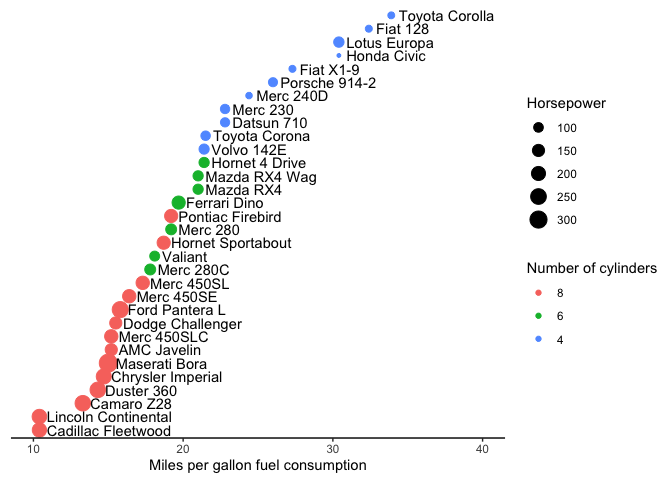

Assignment 9: Functions and factors
================

<br>

## Instructions: Please read through this before you begin

-   This homework is due by **10pm on Thursday 03/31/20**. Please upload
    it using your personal GitHub repository for this class.

-   Please name your R markdown file `assignment_9.Rmd` and the knitted
    markdown file `assignment_9.md`.

-   For this assignment, please **reproduce this markdown file** using R
    markdown. This includes the followings:

    -   **Reproduce this markdown template**, except for this list of
        instructions which you **don’t** have to include. Pay attention
        to all the formating in this file, including bullet points,
        bolded characters, inserted code chunks, headings, text colors,
        blank lines, etc.

    -   Have all your code embedded within the R markdown file, and show
        **BOTH your code and plots** in the knitted markdown file.

    -   Use R Markdown functionalities to **hide messages and warnings
        when needed**. (Suggestion: messages and warnings can often be
        informative and important, so please examine them carefully and
        only turn them off when you finish the exercise).

-   To start, first load all the required packages with the following
    code. Install them if they are not installed yet.

``` r
library(tidyverse)
library(knitr)
```

<br>

**Acknowledgements:** Exercises 1 and 2 were adapted (with permission)
from Iain Carmichael’s course [STOR 390: Introduction to Data
Science](https://idc9.github.io/stor390/#course_material).

<br>

## Exercise 1: Unit converter

**1.1 Write a function that can convert Fahrenheit to Celsius**, based
on the following fomula: `C = (F - 32) * 5 / 9`

Take your function for a spin, does it return the correct values?

32 F = 0 C

``` r
f_to_c(32)
```

    ## [1] 0

50 F = 10 C

``` r
f_to_c(50)
```

    ## [1] 10

212 F = 100 C

``` r
f_to_c(212)
```

    ## [1] 100

<br>

**1.2** A student came from ‘tropical Canada’. She doesn’t like the cold
but she really didn’t like it when it’s hot. Although she wanted to know
what the temperature is in Celsius when the US weather channel reported
it in Fahrenheit, there are certain points at which it was just too cold
or too hot for to to care about the exact value. **Modify the f_to_c
function below to print the following**, and check if your function
works properly using the input of **-10 F, 60 F, and 90 F**.

-   If the temperature is less than -20 C, print “Don’t bother going
    out.”

-   If the temperature is greater than 30 C, print “I’m moving back to
    Canada.”

-   If the temperature is between -20 C and 30 C, print the temperature
    in Celsius.

The following is how it should work:

``` r
f_to_c_message(-10)
```

    ## [1] "Don't bother going out."

``` r
f_to_c_message(60)
```

    ## [1] 15.55556

``` r
f_to_c_message(90)
```

    ## [1] "I'm moving back to Canada."

<br> <br>

## Exercise 2: Set operation

The R function `setdiff(x,y)` returns the elements of a vector x that
are not in y. For example, say x is a list of singers who can reach very
high registers, and y is a list of musicians who died in 2016.
`setdiff(x, y)` would return a list of singers with high voices who did
not die in 2016.

``` r
x <- c("prince", "mj", "sam cook", "whitney", "dolly")
y <- c("sharon jones", "prince", "bowie", "leonard cohen", "phife dawg")
setdiff(x,y)
```

    ## [1] "mj"       "sam cook" "whitney"  "dolly"

However, sometimes you want a function to return the elements that are
in x or y but not both. Here, **write such a function**, and use your
custom function to **find the names of singers who either have high
voices, but did not die in 2016, OR who died in 2016 but do not have
high voices.**

Your function will need to work for any vectors, not just the ones in
this example. The output should be a single vector, not two vectors.

**Hint**: you will need R’s [set
operations](https://stat.ethz.ch/R-manual/R-devel/library/base/html/sets.html).

The following is how it should work:

``` r
#Example output
unique_element(x,y)
```

    ## [1] "mj"            "sam cook"      "whitney"       "dolly"        
    ## [5] "sharon jones"  "bowie"         "leonard cohen" "phife dawg"

<br> <br>

## Exercise 3: Fuel Efficiency of Car Models

This exercise uses the `mtcars` dataset, which is available in base R.
It was extracted from the 1974 Motor Trend US magazine, and comprises
fuel consumption and 10 aspects of automobile design and performance for
32 automobiles (1973–74 models). Let’s first convert `mtcars` to tibble
format such that the row names become a column named “model”.

``` r
mtcars_tbl <- as_tibble(mtcars, rownames = "model")
mtcars_tbl %>%
  head() %>%
  kable()
```

| model             |  mpg | cyl | disp |  hp | drat |    wt |  qsec |  vs |  am | gear | carb |
|:------------------|-----:|----:|-----:|----:|-----:|------:|------:|----:|----:|-----:|-----:|
| Mazda RX4         | 21.0 |   6 |  160 | 110 | 3.90 | 2.620 | 16.46 |   0 |   1 |    4 |    4 |
| Mazda RX4 Wag     | 21.0 |   6 |  160 | 110 | 3.90 | 2.875 | 17.02 |   0 |   1 |    4 |    4 |
| Datsun 710        | 22.8 |   4 |  108 |  93 | 3.85 | 2.320 | 18.61 |   1 |   1 |    4 |    1 |
| Hornet 4 Drive    | 21.4 |   6 |  258 | 110 | 3.08 | 3.215 | 19.44 |   1 |   0 |    3 |    1 |
| Hornet Sportabout | 18.7 |   8 |  360 | 175 | 3.15 | 3.440 | 17.02 |   0 |   0 |    3 |    2 |
| Valiant           | 18.1 |   6 |  225 | 105 | 2.76 | 3.460 | 20.22 |   1 |   0 |    3 |    1 |

From `mtcars_tbl`, reproduce the following plot, which shows the miles
per gallon (`mpg`) of car models on the x axis (see hints below).
Different models are ordered on the y axis according to their `mpg` and
their names are shown next to the data points. Also, the size of each
data point maps to its horse power (`hp`), and the color maps to number
of cylinders (`cyl`).

<!-- -->

<br>

**Hints:**

-   Start by reordering the factor levels of the `model` column based on
    values in the `mpg` column.

-   You may also need to convert `cyl` first into a character variable
    (`as.character()`) or a factor (`factor` or `as_factor()`), and then
    (re)set its factor levels.

-   When making the plot, please pay attention to the following elements
    of the plot that need to be specified.

    -   Horizontal adjustment of the text labels (“`hjust`” option in
        `geom_text()`)
    -   The range of the x-axis (`xlim()`)
    -   x-axis label and legend titles (`labs()`)
    -   The preset theme (`theme_*()`)
    -   The removal of the y-axis (`theme()`)
